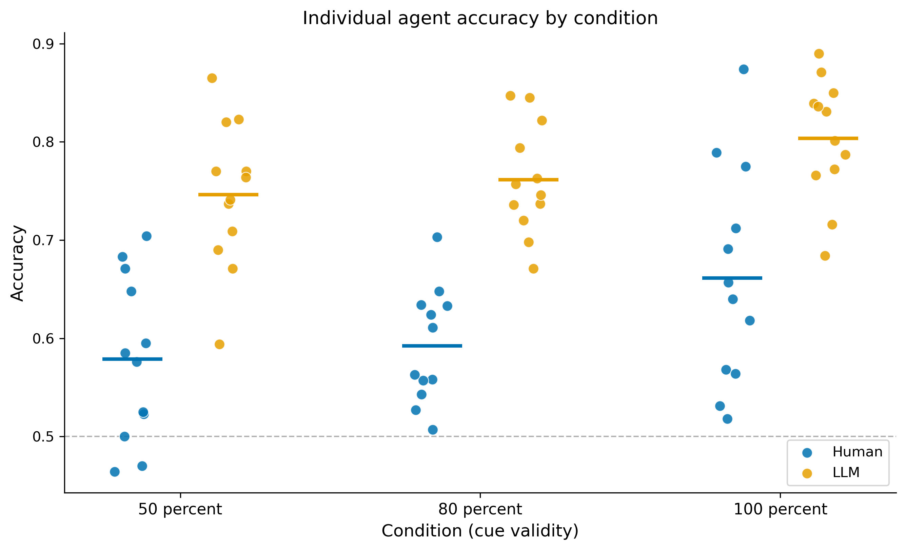

## Summary {.unnumbered}

This report compares how groups of humans and groups of large language models make collective decisions on an identical perceptual task, and measures both against the optimal decision-maker for that task. On a two-alternative target-detection task with known ground truth, LLM groups substantially outperform human groups at every difficulty level, and LLM ensembles reach within 3 to 5 percentage points of the Bayesian ideal observer while human ensembles remain 14 to 25 points below it. For both populations, pooling more agents helps at first and then saturates quickly, with each added agent contributing less than one percentage point past roughly five agents. The reason is that agent errors are positively correlated, so a group of twelve provides meaningfully less than twelve independent votes. This is a controlled measurement of an assumption that underlies most ensemble and multi-agent system design: that adding an agent adds independent evidence.

The dataset was provided by a graduate student collaborator. The analysis, framing, and interpretation in this report are the author's own.

# Background

Group decisions often beat individual ones, a phenomenon studied for decades as the wisdom of the crowd. The benefit is usually explained by the Condorcet Jury Theorem (Condorcet, 1785): if each member is better than chance and members are independent, majority voting drives group accuracy toward certainty as the group grows. The independence clause is doing most of the work. When members share information or make correlated errors, the marginal value of each added member shrinks, and the group saturates well below the theorem's promise.

This question has a direct lineage in perceptual decision-making. Juni and Eckstein (2015) showed that human groups can flexibly adapt how they combine individual decisions as the information environment changes, rather than relying on a single fixed rule. A recurring theme in that line of work is that observers viewing the same stimuli share external sources of variability, which correlates their judgments and reduces the benefit of pooling them. The present project extends that question from human groups to ensembles of large language models, and asks three things on a single task: how close each population gets to the optimal observer, how quickly the benefit of adding agents saturates, and how correlated the agents' errors are.

The framing matters beyond perception. Ensemble methods, model voting, mixture-of-experts routing, and multi-agent LLM systems all assume that an added model contributes independent signal. If that assumption fails, naive aggregation overcounts redundant agreement and produces false confidence. This report is a clean, measured case of that failure mode, with current models, on a task where the correct answer is known on every trial.

# Data and task

The task is a two-alternative forced-choice target-detection problem. On each trial an agent views a display and reports whether a target is present. A spatial cue indicates the likely target location, and cue validity sets the difficulty across three conditions: 50 percent (an uninformative cue), 80 percent, and 100 percent valid. Each agent completed 1,000 trials per condition.

The data comprise twelve human participants and twelve LLM agents, each judging the same trials, for a total of 72,000 decisions (36,000 human, 36,000 LLM) with ground truth on every trial. One human participant was excluded for data quality before the analysis files were created; the analysis here uses the twelve participants present in those files.

The twelve LLM agents span current models across providers: GPT-4.1, GPT-5, GPT-5-mini, o3, o4-mini, Claude 3.5 Haiku, Claude 3.7 Sonnet, Claude Opus 4, Claude Sonnet 4, Gemini 2.5 Flash, and Gemini 2.5 Pro. Gemini 2.5 Pro appears under two readout methods: one where the model estimated the stimulus angle which was then mapped to a decision (`gemini-2.5-pro-angle`), and one where the model returned the decision directly (`gemini-2.5-pro-decision`). These are treated as two agents. Their elevated mutual correlation is expected, since they share an underlying model, and is noted again in the limitations.

# Methods

All figures in this report are computed from the data and recorded with their source in `reports/VERIFIED_NUMBERS.md`, which traces every number to the notebook or output file that produced it.

**Individual performance.** Accuracy, hit rate, false-alarm rate, sensitivity (d-prime), and criterion are computed per agent per condition using Signal Detection Theory, with a log-linear correction applied to extreme rates.

**Ensemble performance.** Group decisions use the majority-voting rule. For each condition and each group size from 1 to 12, accuracy is estimated by drawing 500 bootstrap resamples of agents. Human ties are broken by mean confidence; the full twelve-agent group is deterministic.

**Optimal benchmark.** A Bayesian Ideal Observer is computed from the true stimulus distributions, giving the maximum accuracy achievable on each condition with the available information. This is the ceiling against which both populations are measured.

**Error correlation.** For each condition, an error vector (1 for incorrect, 0 for correct) is built per agent and indexed by stimulus, and the Pearson correlation is computed for all 66 unique agent pairs.

# Results

## Individual performance

LLM agents outperform human participants at the individual level in every condition, with roughly two to three times the sensitivity (@tbl-individual). The gap is largest where it matters least, on the easy 100 percent condition, and persists on the uninformative 50 percent condition where the cue carries no information. The advantage holds across individual agents, not only in the pooled means (@fig-individual).

| Condition (cue validity) | Group | Mean accuracy | SD | Mean d-prime |
|---|---|---|---|---|
| 50 percent | Human | 0.579 | 0.084 | 0.490 |
| 80 percent | Human | 0.592 | 0.058 | 0.552 |
| 100 percent | Human | 0.661 | 0.111 | 0.901 |
| 50 percent | LLM | 0.746 | 0.074 | 1.457 |
| 80 percent | LLM | 0.761 | 0.056 | 1.564 |
| 100 percent | LLM | 0.804 | 0.062 | 1.885 |

: Individual agent performance by condition, pooled within each population. {#tbl-individual}

{#fig-individual width=100%}

## Ensemble performance and saturation

Pooling agents helps both populations, but the gains arrive early and then flatten (@fig-headline). Measured as accuracy added per extra agent, the marginal benefit falls below one percentage point by around five agents in every condition, for both humans and LLMs. There is no sharp cutoff; the curve simply bends. The full twelve-agent group is not meaningfully better than a group of five or seven. A naive independence prediction, what the same agents would reach if their errors were uncorrelated, sits well above the observed ensemble (@fig-independence). But it also rises above the Bayesian ceiling, so it is not achievable: a genuinely ambiguous stimulus misleads every agent at once, and that shared error cannot be diversified away. Measured against what is achievable, the LLM ensemble is already within a few points of the ideal observer, so correlation mainly explains why the gains stop early rather than leaving large accuracy unclaimed.

{#fig-headline width=100%}

![Observed LLM ensemble accuracy (solid) against two reference lines, by group size and condition. The independence prediction (dashed) is the Condorcet majority-vote accuracy the same agents would reach if their errors were fully independent, computed by permuting each agent's per-trial correctness. The Bayesian ideal observer ceiling (dotted) is the highest accuracy any decision-maker can reach with this stimulus information. The independence prediction sits above the ideal observer, which is not achievable: it removes correlation that is structural to the task, since a genuinely ambiguous stimulus misleads every agent at once. The meaningful comparison is observed against the ideal observer, a gap of only a few points for the LLM ensemble. Correlation is why the gains stop early, not a large amount of recoverable accuracy.](../outputs/ensemble-vs-independence.png){#fig-independence width=100%}

## Distance from the optimal observer

The more striking result is where each population lands relative to the optimum (@tbl-bio). LLM ensembles come within 3 to 5 percentage points of the Bayesian ideal observer across all conditions. Human ensembles remain 14 to 25 points below it. The LLM ensemble is not only better than the human ensemble; it is close to the best any decision-maker could do with this information.

| Condition | Human n=12 | LLM n=12 | BIO ceiling | LLM gap | Human gap |
|---|---|---|---|---|---|
| 50 percent | 0.637 | 0.835 | 0.886 | -0.051 | -0.249 |
| 80 percent | 0.656 | 0.852 | 0.886 | -0.034 | -0.230 |
| 100 percent | 0.784 | 0.884 | 0.920 | -0.036 | -0.136 |

: Full ensemble accuracy against the Bayesian ideal observer ceiling. {#tbl-bio}

## Error correlation

The early saturation has a mechanism. Agent errors are positively correlated: agents tend to fail on the same trials (@tbl-corr, @fig-correlation). Across conditions the mean pairwise error correlation is about 0.29, most pairs fall in the weak-to-moderate range, and no pair is more than negligibly negative. Strong correlation (r above 0.5) is present but uncommon, in 8 to 14 percent of pairs depending on condition, and the most correlated pair is the two readout methods of the same Gemini model. Positive correlation of this size is enough to make a group of twelve worth less than twelve independent votes, which is consistent with the saturation seen above, although this report does not formally decompose the effective sample size.

{#fig-correlation width=100%}

| Error-correlation band | 50 percent | 80 percent | 100 percent |
|---|---|---|---|
| Strong positive (r > 0.5) | 9.1% | 7.6% | 13.6% |
| Weak-to-moderate positive (0.2 to 0.5) | 51.5% | 59.1% | 56.1% |
| Near-independent (\|r\| <= 0.2) | 39.4% | 33.3% | 30.3% |
| Strong negative (r < -0.2) | 0% | 0% | 0% |
| Mean r | 0.269 | 0.291 | 0.297 |

: Distribution of pairwise error correlation across the 66 LLM agent pairs. {#tbl-corr}

# Discussion

Three findings hold together. LLM ensembles approach the optimal observer while human ensembles fall well short. Both populations stop benefiting from added agents early. And agent errors are positively correlated, so each added agent carries less than an independent vote. The correlation result is the connective tissue: it is why the curves flatten, and it is the link back to the lab's earlier finding that shared variability among observers limits collective benefit. Here the shared variability is not a noisy stimulus viewed by many eyes but a common difficulty structure that many models fail on together.

For applied AI systems, the practical reading is direct. The value of adding a model to an ensemble, a committee, or a mixture-of-experts router is not fixed; it depends on whether that model's errors are independent of the errors already present. Counting agreement as independent confirmation, as majority voting implicitly does, overstates the group's reliability whenever members are correlated. On this task, that overstatement begins almost immediately, since the agents are already correlated at the smallest group sizes.

The result also reframes the human-versus-LLM comparison. The interesting quantity is not that the models are more accurate, which is expected, but that an ensemble of off-the-shelf models lands within a few points of the information-theoretic ceiling on a task built to study human perception. The remaining gap to the optimum is small enough that better aggregation, rather than better individual models, is the natural lever.

# Limitations

The dataset was provided by a graduate student collaborator. The contribution here is the analysis and interpretation, not the data collection. One participant was excluded before the analysis files were created, and the excluded identity is not recoverable from those files.

Two of the twelve LLM agents are the same underlying model under different readout methods. This slightly increases redundancy in the LLM set and contributes to the correlation structure, and the pair is among the most correlated.

The error-correlation result is observational. Positive correlation is consistent with the early saturation, but this report does not formally establish that correlation causes the specific plateau point, which would require an effective-sample-size decomposition or a controlled manipulation of correlation.

Finally, this is a single perceptual task with one stimulus family. The accuracy levels, the size of the human-LLM gap, and the exact saturation point are specific to this task. The qualitative pattern, that correlated errors cap ensemble benefit, is expected to generalize, but the numbers should not be read as task-independent.

# Future work

The natural next step is to test whether an aggregator can do better than majority voting by accounting for correlation, rather than treating every agent as independent. A planned follow-up, correlation blindness, uses an LLM as the aggregator and asks whether it discounts correlated agents or treats their agreement as independent confirmation. A corrected weighted-combination analysis is also a clear next step, since prior work in this area shows that confidence-weighted rules can beat majority voting; an initial weighted-combination implementation in this project was found to be invalid, applying a log-odds transform to binary inputs, and was removed rather than reported. Extending the comparison to mixed human-LLM ensembles is a further direction.

# References {.unnumbered}

Condorcet, M. de (1785). *Essai sur l'application de l'analyse à la probabilité des décisions rendues à la pluralité des voix*. Paris: Imprimerie Royale.

Juni, M. Z., & Eckstein, M. P. (2015). Flexible human collective wisdom. *Journal of Experimental Psychology: Human Perception and Performance, 41*(6), 1588–1611. https://doi.org/10.1037/xhp0000101

Juni, M. Z., & Eckstein, M. P. (2017). The wisdom of crowds for visual search. *Proceedings of the National Academy of Sciences, 114*(21), E4306–E4315. https://doi.org/10.1073/pnas.1700010114
